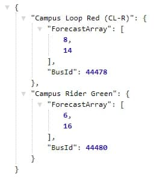
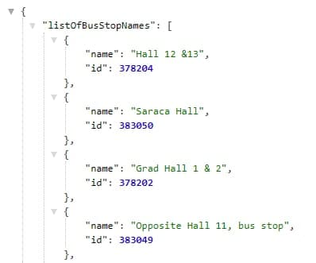
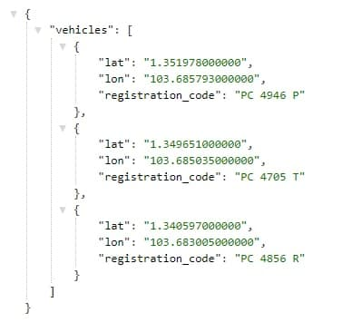

# Bus Timing API
Backend service created with Go Programming Language that uses 2 endpoints and reformats the data into a cleaner format that a Bus app frontend can use

# API methods
1. Get bus timing at a certain bus stop id
    - path: "/bus-timing"
    - query string: "bus-id"
    - return format: { "bus name" : [ array of subsequent bus timing ], ... }
    - cache: able to cache bus timing information at a certain stop, expires after 1 minute
    - example:

        
    - reason for design: Data was originally in the form of an array of bus timings, and the same buses were not grouped together. As such, I grouped the timings of the same bus into 1 map entry so that the frontend does not have to organise the data
2. Get list of bus stops that exists
    - path: "/list-of-bus-stop"
    - return format: { "ListOfBusStopNames" : [ { "name": "name", "id" : "id" }, ... ] }
    - cache: only need to be called once when the server is started
    - example:
    
        
    - reason for design: This api call is meant to load the list of bus stops when the server is started. It returns name (to be displayed on frontend) and id (which has to be stored to use for future api calls such as bus timing)
3. Get list of bus locations for a certain bus line id
    - path: "/bus-location"
    - query string: "bus-id"
    - return format: { "vehicles": [ {"lat": "lat", "lon": "lon","registration_code": "registration_code"}, ... ]}
    - example:
    
        
    - reason for design: Only returns relevant information which is lat and lon which is used to display locations on the map, registration code (which is license plate) can also be used to uniquely identify buses on the map
