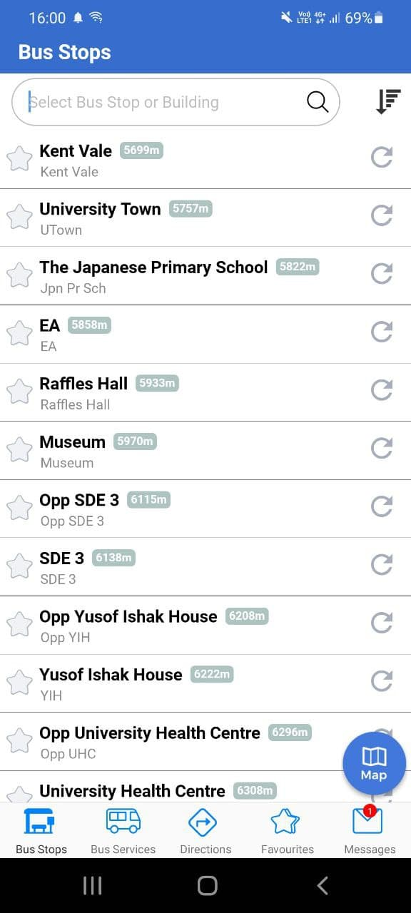
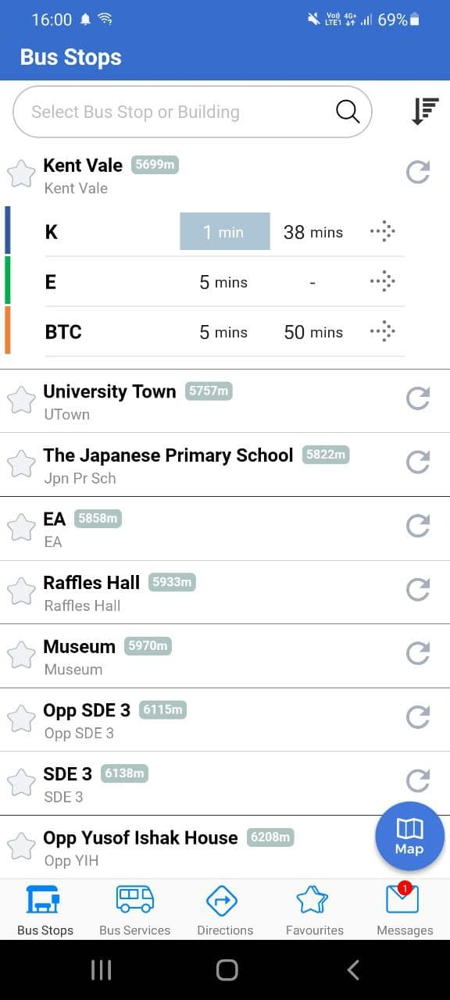
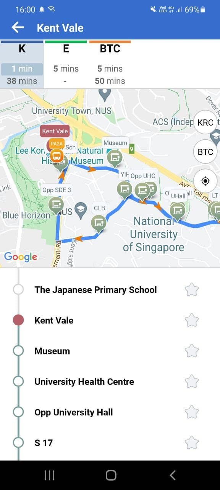

# Bus Timing API
Backend service created with Go Programming Language that uses 2 endpoints and reformats the data into a cleaner format that a Bus app frontend can use

# API methods
1. Get bus timing at a certain bus stop id
    - path: "/bus-timing"
    - query string: "bus-stop-id"
    - return format: { "bus name" : 
        {
        "ForecastArray": [ array of subsequent bus timing ],
        "BusId": "BusId"
         }
    - cache: able to cache bus timing information at a certain stop, expires after 1 minute
    - example:

        
    - reason for design: Data was originally in the form of an array of bus timings, and the same buses were not grouped together. As such, I grouped the timings of the same bus into 1 map entry so that the frontend does not have to organise the data
2. Get list of bus stops that exists
    - path: "/list-of-bus-stop"
    - return format: { "ListOfBusStopNames" : [ { "name": "name", "id" : "id" }, ... ] }
    - cache: only need to be called once when the server is started
    - example:
    
        
    - reason for design: This api call is meant to load the list of bus stops when the server is started. It returns name (to be displayed on frontend) and id (which has to be stored to use for future api calls such as bus timing)
3. Get list of bus locations for a certain bus line id
    - path: "/bus-location"
    - query string: "bus-id"
    - return format: { "vehicles": [ {"lat": "lat", "lon": "lon","registration_code": "registration_code"}, ... ]}
    - example:
    
        
    - reason for design: Only returns relevant information which is lat and lon which is used to display locations on the map, registration code (which is license plate) can also be used to uniquely identify buses on the map

# How the frontend will use this API
- assumptions: I will assume the frontend is the NUS NextBus App

    
    
    

In the first image, "/list-of-bus-stop" API call is used to generate information on bus stop names

In the second image, "/bus-timing" API call is used to get bus timings for each bus using the id that was saved from the previous call. Note that the format of the Json matches the format of the frontend exactly

In the third image, "/bus-location" API call is used to get the location of all the buses of a bus line using bus-id from the previous call

# Improvements

The power of caching becomes apparent in the "/bus-timing" API call. Once an API call is made to the provided endpoint, this API will cache the bus timing arrival information and return instantly when another API call is made. To ensure optimal accuracy, this cache is only valid for 1 minute. The benefit of this is that it can reduce the number of API calls to the endpoints yet balance the accuracy of the bus timing.